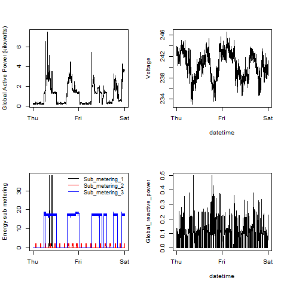

# R Data Visualization & Data Products
mspcvsp  
11/13/2014  

---
## Introduction

- [Johns Hopkins University Data Science Cousera Specialization](https://www.coursera.org/specialization/jhudatascience/1)  
- R Language Graphics Libraries  
    - [Base](http://rpubs.com/SusanEJohnston/7953) 
    - [Lattice](http://www.statmethods.net/advgraphs/trellis.html)
    - [ggplot2](http://docs.ggplot2.org/current/)

--- .class #id 
## Johns Hopkins University Data Science Cousera Specialization
- [The Data Scientist's Toolbox](https://www.coursera.org/course/datascitoolbox)
- [R Programming](https://www.coursera.org/course/rprog)
- [Getting & Cleaning Data](https://www.coursera.org/course/getdata)
  - [Tidy Data](http://www.prometheusresearch.com/good-data-management-practices-for-data-analysis-tidy-data-part-2/)
- [Exploratory Data Analysis](https://www.coursera.org/course/exdata)
- [Reproducible Research](https://www.coursera.org/course/repdata)
- [Statistical Inference](https://www.coursera.org/course/statinference)
- [Regression Models](https://www.coursera.org/course/regmods)
- [Practical Machine Learning](https://www.coursera.org/course/predmachlearn)
- [Developing Data Products](https://www.coursera.org/course/devdataprod)

---
## R Language Base Graphics Library  
  
- [Plot Generation Code](https://github.com/datasciencespm/ExData_Plotting1/blob/master/plot4.R)
    - [Individual Household Electric Power Consumption Data Set](https://archive.ics.uci.edu/ml/datasets/Individual+household+electric+power+consumption)  

  
  
<small style="font-size:.5em">Bache, K. & Lichman, M. (2013).
<a href="http://archive.ics.uci.edu/ml">UCI Machine Learning Repository</a>
 Irvine, CA: University of California, School of Information and Computer Science.
</small>