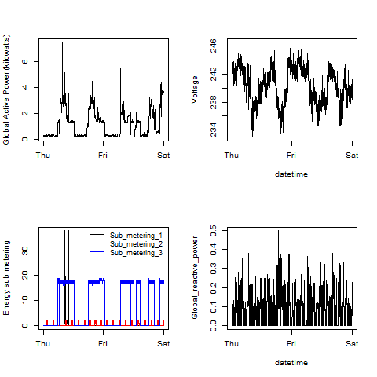

# R Data Visualization & Data Products
mspcvsp    
11/13/2014  

---
## Introduction

- [Johns Hopkins University Data Science Coursera Specialization](https://www.coursera.org/specialization/jhudatascience/1)  
- R language graphics libraries  
    - [base](http://rpubs.com/SusanEJohnston/7953) 
    - [lattice](http://www.statmethods.net/advgraphs/trellis.html)
    - [ggplot2](http://docs.ggplot2.org/current/)
    - [GGally](http://tgmstat.wordpress.com/2013/11/13/plot-matrix-with-the-r-package-ggally/)  
- R language data products
    - [R Markdown language](http://rmarkdown.rstudio.com/)
    - [Slidify](http://slidify.github.io/interactive/)
    - [Shiny web application](http://shiny.rstudio.com/)

--- .class #id 
## Johns Hopkins University Data Science Coursera Specialization
- [The Data Scientist's Toolbox](https://www.coursera.org/course/datascitoolbox)
- [R Programming](https://www.coursera.org/course/rprog)
- [Getting & Cleaning Data](https://www.coursera.org/course/getdata)
  - [Tidy data](http://www.prometheusresearch.com/good-data-management-practices-for-data-analysis-tidy-data-part-2/)
- [Exploratory Data Analysis](https://www.coursera.org/course/exdata)
- [Reproducible Research](https://www.coursera.org/course/repdata)
- [Statistical Inference](https://www.coursera.org/course/statinference)
- [Regression Models](https://www.coursera.org/course/regmods)
- [Practical Machine Learning](https://www.coursera.org/course/predmachlearn)
- [Developing Data Products](https://www.coursera.org/course/devdataprod)
- [Capstone Project](http://simplystatistics.org/2014/08/19/swiftkey-and-johns-hopkins-partner-for-data-science-specialization-capstone/)

---
## R Language Base Graphics Library  
  
- [Plot generation code](https://github.com/datasciencespm/ExData_Plotting1/blob/master/plot4.R)
    - <small style="font-size:0.8em">[Individual Household Electric Power Consumption Data Set](https://archive.ics.uci.edu/ml/datasets/Individual+household+electric+power+consumption)</small>  

  
  
<small style="font-size:.5em">Bache, K. & Lichman, M. (2013).
<a href="http://archive.ics.uci.edu/ml">UCI Machine Learning Repository</a>
</br>Irvine, CA: University of California, School of Information and Computer Science.
</small>

---
## R Language Lattice Graphics Library  
  
* Scatter plot matrix reference:
    - <small style="font-size:0.8em">[Lamigueiro, O.P. "How to display scatter plot matrices with R and lattice"](http://procomun.wordpress.com/2011/03/18/splomr/)</small>
*  <small style="font-size:0.8em">[Air quality dataset](https://stat.ethz.ch/R-manual/R-devel/library/datasets/html/airquality.html)</small>  
</br>
```{r latticeGraphExample,fig.align='center',fig.height=6.5,echo=FALSE,results='hide'}
library(lattice)
library(hexbin)
data(airquality)
splom(airquality[,seq(1:4)],
      pch=19,
      panel=panel.hexbinplot,
      colramp=BTC,
      main="Air Quality Dataset",
      lower.panel = function(x, y, ...){
          panel.hexbinplot(x, y, ...)
          panel.loess(x, y, ..., col = 'red')
      })
```

---
## ggplot2 
  
- [R Graphics Cookbook](http://www.cookbook-r.com/Graphs)
- [RColorBrewer R package](http://simplystatistics.org/2011/10/17/colors-in-r/)
- [Plot generation code](https://github.com/datasciencespm/GettingAndCleaningData/blob/master/plotTidyData.R)
    - <small style="font-size:0.8em">[Human Activity Recognition Using Smartphones Dataset](http://archive.ics.uci.edu/ml/datasets/Human+Activity+Recognition+Using+Smartphones)</small>  
    
  
<small style="font-size:.5em">Bache, K. & Lichman, M. (2013).
<a href="http://archive.ics.uci.edu/ml">UCI Machine Learning Repository</a>
</br>Irvine, CA: University of California, School of Information and Computer Science.
</small>

---
## ggplot2 
- [R Graphics Cookbook](http://www.cookbook-r.com/Graphs)
- [Plot generation code](http://rpubs.com/mspcvsp/noaaStormDatabase)
    - <small style="font-size:0.8em">[NOAA Storm Events Database](http://www.ncdc.noaa.gov/stormevents/)</small>  
  
  

---
## GGally
- [GGally R package description](http://tgmstat.wordpress.com/2013/11/13/plot-matrix-with-the-r-package-ggally/)  
- [Plot generation code](https://github.com/datasciencespm/DevelopingDataProducts/blob/master/server.R)  
    - <small style="font-size:0.8em">[Motor Trend Car Road Tests dataset](https://stat.ethz.ch/R-manual/R-devel/library/datasets/html/mtcars.html)</small>  
    
  

---
## R Markdown Language  
- [Reproducible Research](http://www.biostat.jhsph.edu/~rpeng/research.html)
    - [Oxford Journals: Biostatistics ](http://biostatistics.oxfordjournals.org/content/10/3/405.full)
- [R Markdown language](http://rmarkdown.rstudio.com/)
- [knitr R package](http://yihui.name/knitr/)
- [R Markdown HTML document](http://rmarkdown.rstudio.com/html_document_format.html)
- [R Markdown ioslides HTML5 presentation](http://rmarkdown.rstudio.com/ioslides_presentation_format.html)
- [R Markdown Beamer PDF presentation](http://rmarkdown.rstudio.com/beamer_presentation_format.html)  

---
## Slidify  
- This presentation was generated using [Slidify](http://slidify.github.io/interactive/)
- [Slidify demo](http://www.r-bloggers.com/slidify-modern-simple-presentations-written-in-r-markdown/)
- [Data Visualization DC / Statistical Programming DC presentation: "Fantastic presentations from R using slidify and rCharts"](http://datacommunitydc.org/blog/2013/08/fantastic-presentations-from-r-using-slidify-and-rcharts/)  
    - [rCharts R package](http://rcharts.io/)
    - [Data Community DC blog article: "Data Visualization: rCharts"](http://datacommunitydc.org/blog/2013/05/data-visualization-rcharts/)  

---
## Shiny Web Application  
- [Shiny web application tutorial](http://shiny.rstudio.com/tutorial/)  
- [Example application](http://datasciencespm.github.io/DevelopingDataProducts/shinyApplicationPresentation.html#/slide-1)
    - [Source code](https://github.com/datasciencespm/DevelopingDataProducts)
      
  

---
## Conclusion  
- R language graphics libraries
    - Line graphs
    - Scatter plot matrix
    - Facets
    - Geographic data visualization
- R language data products
    - R Markdown language
    - R Markdown HTML document
    - R Markdown presentations
    - Slidify
    - Shiny web application
    